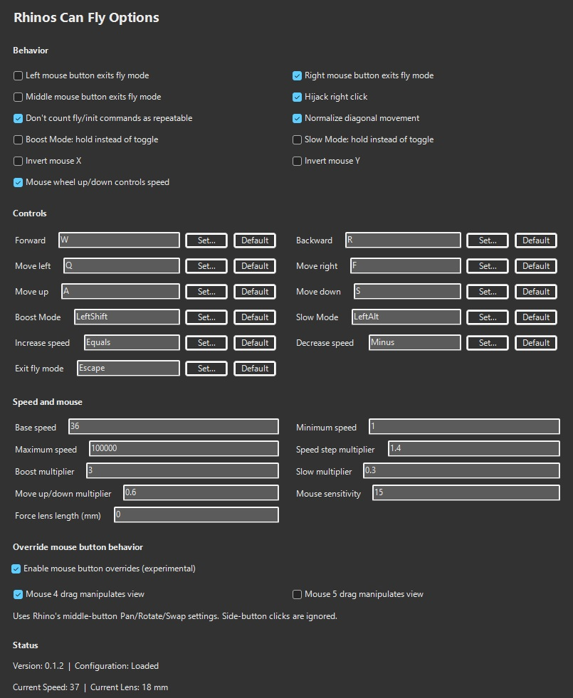
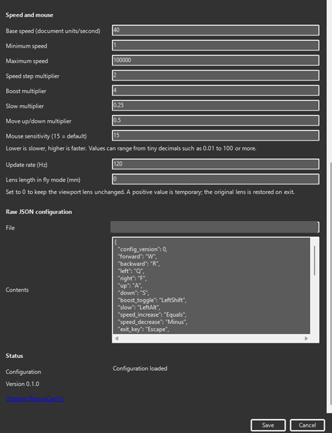

# RhinosCanFly - Rhinos Can Fly - Oldschool level editor flying camera controls for Rhino 3D

Pigs might fly? Well rhinos do now.

WASD or weird binds flying camera for Rhino in perspective view. Windows only (sad trombone noises, Rhino doesn't like supporting Linux).

## Demo

https://github.com/user-attachments/assets/6fbaad3c-c2d6-4bbf-ac0b-b4c217015698

## Extras

It only hijacks right click when in perspective view, and still allows commands with right click when doing edits (for confirming etc).

Blender says no, Rhino also says no, but we're gonna do it anyway and intercept right click at an extension level, and pass it on depending on context (very nice).

Do you want hammer source1/source2 ish old level editing camera controls, or modern game engine (unreal engine / unity / godot) camera controls? No? Just Me? Well ok...

## Recommendations

- Go to Tools -> Options... -> Mouse, set middle mouse button to `Manipulate view` and `rotate`.

- Set lens length in your file/project/default rhino setup to something like `18` or so, which gives that 100 FOV feel. (Not in the addon options, that's a temp toggle).

- Right click on Gumball at the bottom and enable `Rotate view around gumball`.

## Run / Commands

`RhinosCanFly` main command, fly around in perspective view, exit on right click and escape.

`RhinosCanFlyOptions` pops up a panel where you can change keybindings / features (same menu is also in Tools -> Options... -> Rhinos Can Fly).

`RhinosCanFlyInit` is only used at startup to not have delay going into the view the first time.

## Options

## Main Install (Package Manager / Yak)

Install in Rhino itself, run `PackageManager` and search for `RhinosCanFly`, click install and restart Rhino.

## Other

[Forum Link](https://discourse.mcneel.com/t/rhinos-can-fly-wasd-game-engine-fly-camera-controls-for-rhino/220880)

[Food 4 Rhino Link](https://www.food4rhino.com/en/app/rhinoscanfly)

[Building On Windows](./docs/building-on-windows.md)

[Other Installation Options](./docs/other-installation-options.md)

## Artistic Logo / Icon

TODO: Waiting for peter's contribution in mspaint

## Disclaimer

Gippity was a major contributor in this, even that is an understatement.

Why F#? I chose microsoft ocaml over microsoft java.

Why no Mac support? I don't have a mac and can't test it. If anybody wants to add Mac support please do (but i think the gui stuff and mouse input stuff is windows only, but shouldn't be impossible. But maybe raw mouse input on mac is annoying?).
