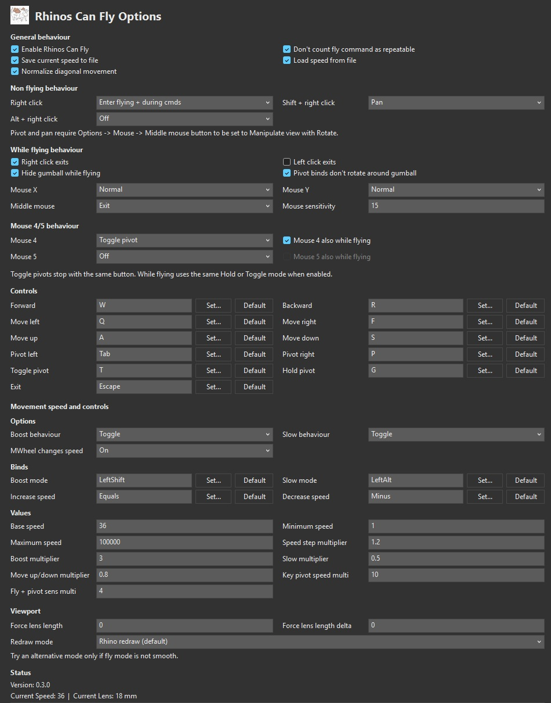
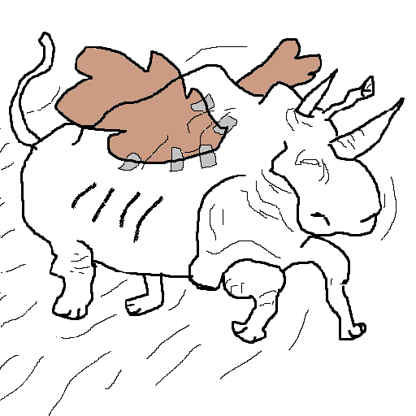

# Rhinos Can Fly - Flying camera controls for Rhino 3D (level editor WASD / custom binds)

## Demo

https://github.com/user-attachments/assets/52dc3237-e12b-4a54-8776-88f6b6475fac

## How to Use / Recommendations

- Right click to enter flying, right click to exit (change it in `RhinosCanFlyOptions`).

- Set lens length in your file/project/default Rhino setup to something like `18` or so, which gives that 100 FOV feel.

## Links

[McNeel / Rhino Forum Link](https://discourse.mcneel.com/t/rhinos-can-fly-wasd-game-engine-fly-camera-controls-for-rhino/220880)

[Food 4 Rhino Link](https://www.food4rhino.com/en/app/rhinos-can-fly-rhinoscanfly-flying-custom-perspective-view)

[Building On Windows](./docs/building-on-windows.md)

[Other Installation Options](./docs/other-installation-options.md)

## Main Commands

`RhinosCanFly` main command, fly around in perspective view, exit on right click and escape, keep the current camera position. (default flying behaviour, usually done with right click)

`RhinosCanFlyOptions` pops up a panel where you can change keybindings / features (same menu is also in Tools -> Options... -> Rhinos Can Fly).

## Extra Commands

`RhinosCanFlyTempFly` goes back to the initial camera position after flight ends, this can be set to default behaviour in options.

`RhinosCanFlySetSpeed` sets the current flying speed, you can also use a bind or the mousewheel up / down in settings.

`RhinosCanFlyPan` pans around via a toggle (extra, if you want the functionality Rhino doesn't provide).

`RhinosCanFlyPivot` pivots around via a toggle (extra, same).

## Options

## Main Install (Package Manager / Yak)

Install in Rhino itself, run `PackageManager` and search for `RhinosCanFly`, click install and restart Rhino.

## Artistic Logo / Icon

We might have to use cardboard wings, but it works. Credit to Peter for the artistic logo.

## If you care about file meta data

If you enable "save current speed to document" it will write the current speed to your Rhino document. Just disable it if you don't want any persisted state.

It only saves "RhinosCanFly\FlyingSpeed"

The project still has a config file for the normal settings, and the options menu will show you the full path like `C:\Users\<username>\AppData\Roaming\McNeel\Rhinoceros\<version>\settings\rhinos-can-fly-config.json` and the raw JSON content.

## Disclaimer

Gippity was a major contributor in this, even that is an understatement.

Why F#? I chose microsoft ocaml over microsoft java.

Why no Mac support? I don't have a mac and can't test / develop it, feel free to add mac support if you want it, all the raw input / windows native stuff will have to be redone, but it is split up in a way so it should be possible (with a lot of work).
